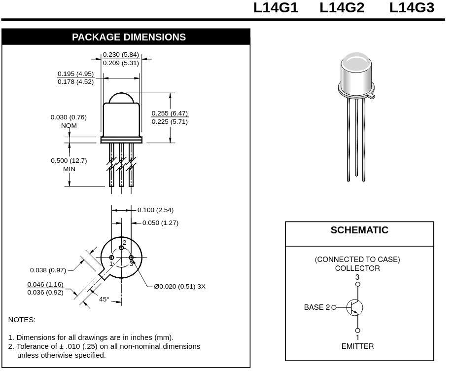
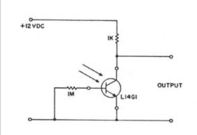
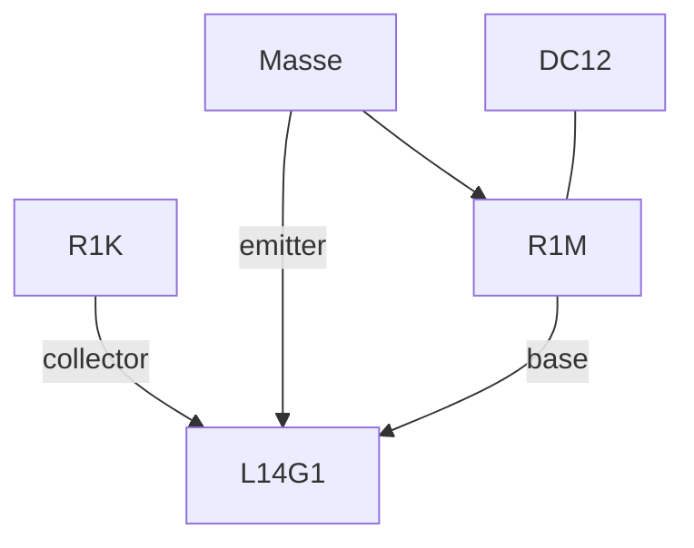

# phototransistor
détection d'objet en mouvement avec phototransistor L14G1, comptage avec arduino

```mermaid
graph TD;
    Masse;
    DC12;
    R1K;
    R1M;
    R1M -->|base| L14G1;
    R1K -->|collector| L14G1;
    Masse -->|emitter| L14G1;
    Masse --> R1M;
    DC12 --- R1M;
```
